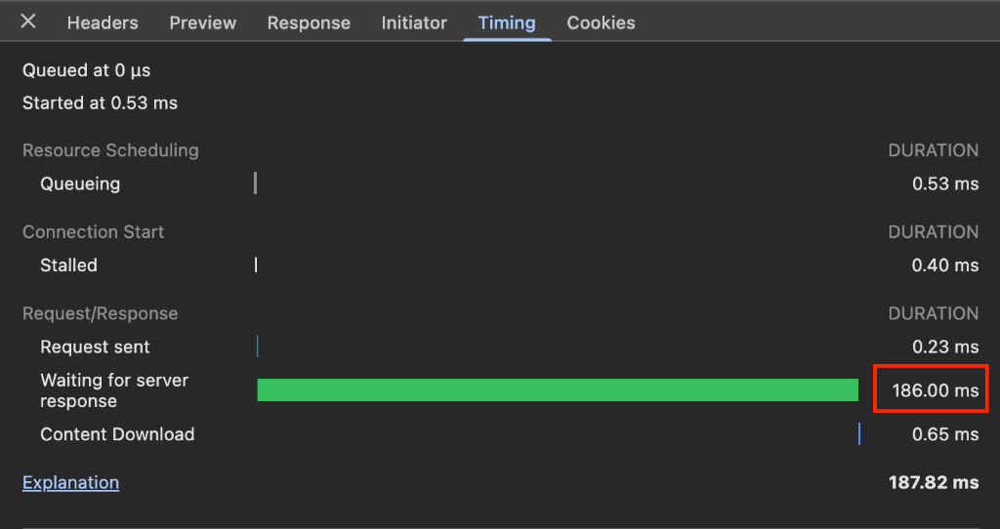
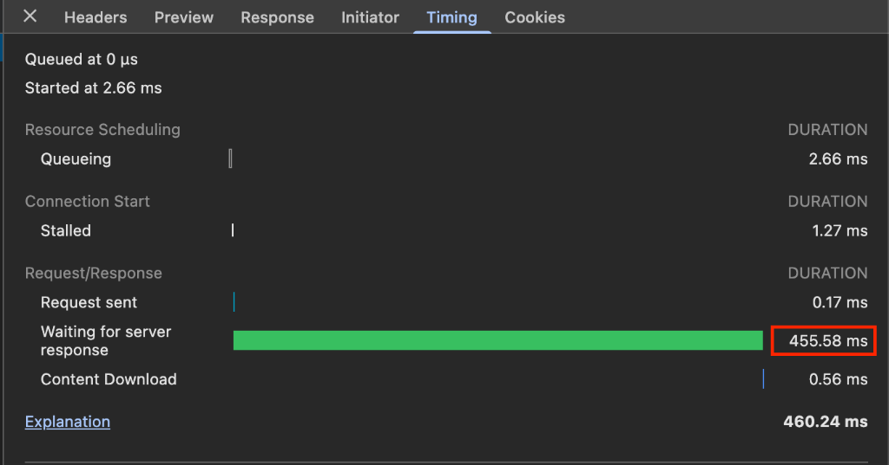

# Laravel Nova Turbo

[](https://packagist.org/packages/shahabzebare/laravel-nova-turbo)
[](https://github.com/shahabzebare/laravel-nova-turbo/actions/workflows/tests.yml)
[](https://packagist.org/packages/shahabzebare/laravel-nova-turbo)
[](https://packagist.org/packages/shahabzebare/laravel-nova-turbo)

🚀 **Turbocharge Laravel Nova** by lazy loading resources.

If you have 50+ resources, Nova can become slow because it loads and runs authorization checks for ALL resources on every page load. This package fixes that by only loading the resources needed for the current page.

## The Problem

Nova's default behavior on every page load:
- Registers **all** resources (e.g., 100 resources)
- Runs `authorizedToCreate()` for **each** resource
- Generates metadata for **all** resources

With Nova Turbo:
- Only loads **1-5** resources per page (current resource + relationships)
- Dramatically improves page load times

## Benchmarks

Real-world performance comparison on a Nova installation with 100+ resources:

| Metric | Without Turbo | With Turbo | Improvement |
|--------|---------------|------------|-------------|
| Server Response Time | 455.58 ms | 186.00 ms | **59% faster** |
| Resources Loaded | ~100 | 1-5 | **95% reduction** |

<details>
<summary>📊 Click to see benchmark screenshots</summary>

### With Nova Turbo (186ms)


### Without Nova Turbo (455ms)


</details>

## Installation

```bash
composer require shahabzebare/laravel-nova-turbo
```

## Setup

### Step 1: Add the trait to your NovaServiceProvider

```php
<?php

namespace App\Providers;

use Laravel\Nova\NovaApplicationServiceProvider;
use Shahabzebare\NovaTurbo\Traits\TurboLoadsResources;

class NovaServiceProvider extends NovaApplicationServiceProvider
{
    use TurboLoadsResources;

    // ... rest of your provider
}
```

### Step 2: Generate the cache

```bash
php artisan nova:turbo-cache
```

This creates a cache file at `bootstrap/cache/nova-turbo.php`.

### Step 3 (Optional): Publish config

```bash
php artisan vendor:publish --tag=nova-turbo-config
```

## Commands

```bash
# Generate/refresh cache
php artisan nova:turbo-cache

# Clear cache
php artisan nova:turbo-cache --clear
```

## Configuration

```php
// config/nova-turbo.php

return [
    // Skip lazy loading in local environment for development
    'auto_refresh_in_dev' => true,

    // Paths to scan for Nova resources
    'resource_paths' => [
        app_path('Nova'),
    ],

    // Auto-regenerate cache when Laravel's cache is cleared (e.g., during deployments)
    'regenerate_on_cache_clear' => true,
];
```

## External Resources

If you have resources outside `app/Nova` (e.g., in modules), register them:

```php
// In your AppServiceProvider or a module service provider
use Shahabzebare\NovaTurbo\NovaTurbo;

public function boot()
{
    NovaTurbo::resources([
        \Modules\Order\Nova\Order::class,
        \Modules\Customer\Nova\Customer::class,
    ]);
}
```

Then re-run `php artisan nova:turbo-cache`.

## Deployment

The cache is **automatically regenerated** when you run `php artisan cache:clear` during deployments (enabled by default via `regenerate_on_cache_clear`).

If you prefer manual control, add to your deployment script:

```bash
php artisan nova:turbo-cache
```

Typical deployment order:

```bash
php artisan config:cache
php artisan route:cache
php artisan cache:clear          # Auto-regenerates turbo cache
# OR manually: php artisan nova:turbo-cache
```

To disable automatic regeneration:
```env
NOVA_TURBO_REGENERATE_ON_CLEAR=false
```

## How It Works

1. The artisan command scans all resources and their relationship fields
2. It builds a dependency map and caches it as a PHP array file (with version tracking)
3. On page load, only the needed resources are registered
4. The cached metadata is sent to the frontend to prevent JavaScript errors
5. Cache is automatically invalidated when the package is updated (version mismatch)

## Development Mode

By default, lazy loading is **disabled** in local environment (`auto_refresh_in_dev = true`). This means you can add/modify resources without running the cache command.

For production-like testing locally:
```bash
NOVA_TURBO_AUTO_REFRESH=false php artisan serve
```

## License

MIT License. See [LICENSE](LICENSE) for details.

## Credits

- [Shahab Zebari](https://github.com/shahabzebare)
